# Simple Java ToDo List Application

## Instroduction
It is a simple console-based Java application that allows a user to create
and maintain an own task list.

## Getting started

1. Clone the repository to any chosen folder in your computer with the following command in termainal:
   
   ```bash
   git clone https://github.com/OlgaPinchuk/to-do-list-sda
   ```
3. Open the project in Intellij or other IDE of your choice, build and run it following your IDE instructions.

Additionally this application can be run directly via Gradle or via a generated `jar` file.

### Run with Gradle
In the root folder start the application with Gradle's run command
```bash
gradle run --console plain
```
### Run with jar file
Generate the `jar` file with Gradle's build command.
```bash
gradle build
```

The jar file will be generated in `build/libs` which can be run by a Java environment.
```bash
java -jar app/build/libs/app.jar
```

## Usage
The application starts with a welcoming screen. It shows the number of tasks in the todo list (initially 0).
The user have 4 options to choose (see the picture below):
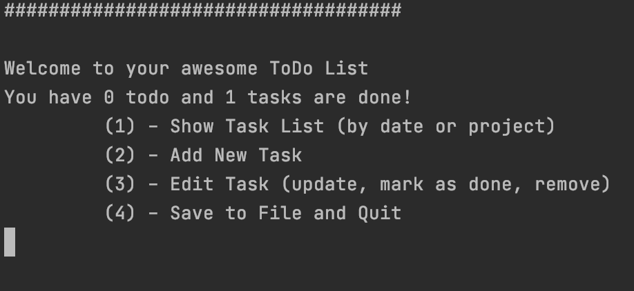

### View the list
If you already have any tasks you can see the list sorted by date or by project.
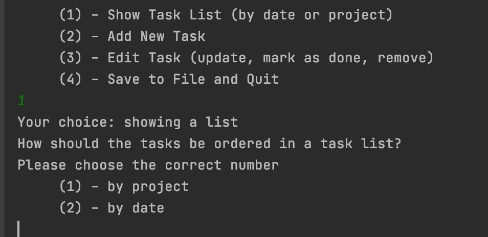
For example:
 - **_by project_**
   
   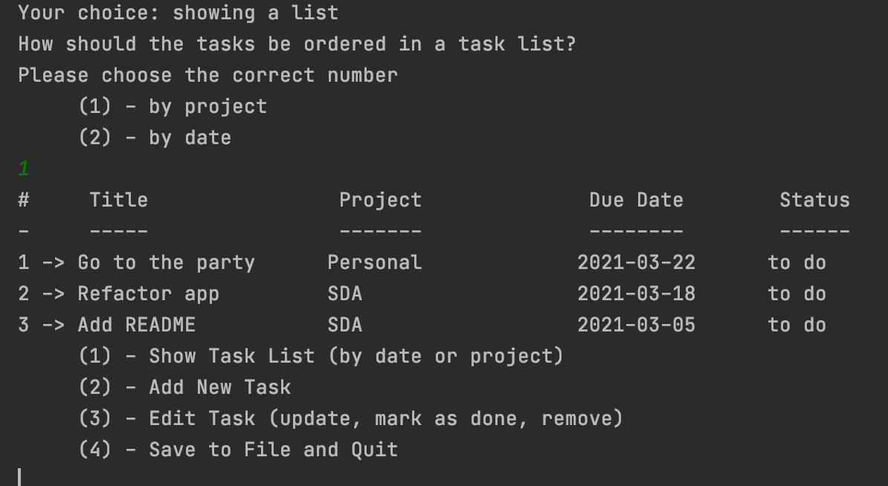
   
  - **_by date_**

    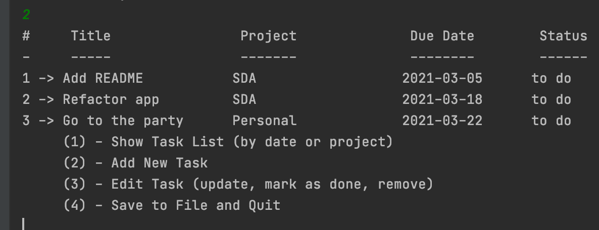

### Add new tasks to the list

User can add a task by providing its title, project and due date
    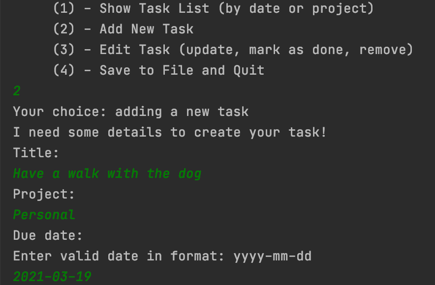

### Edit tasks

An application supports the ability of editing existing tasks fields, marking them as done or deleting them from the list.
User should first choose the number of the task to edit and then editing options.
    - **_editing fields_**
        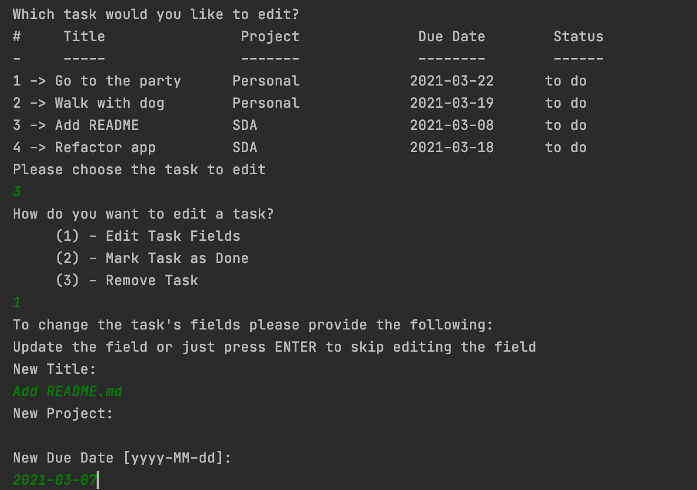
    - **_marking as done_**
        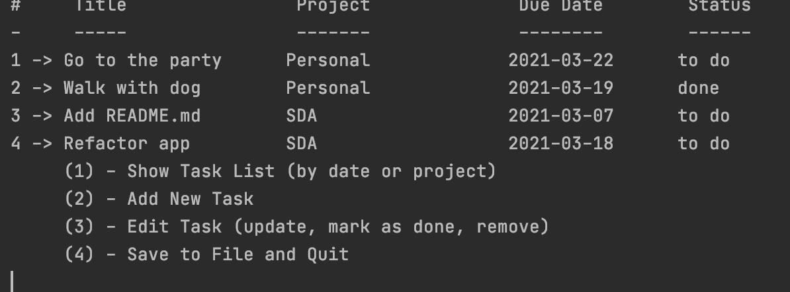
    - **_removing_**
        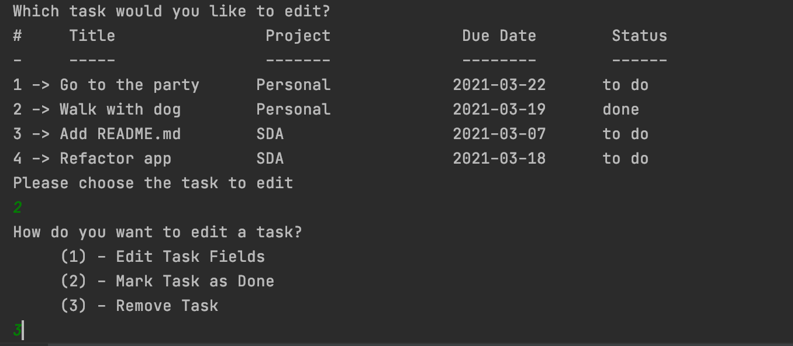
        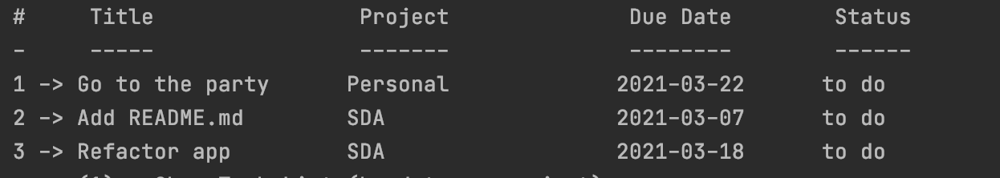

### Save and quit
Finally a user can also quit and save a current copy of the list to file, and then restart the application with former state restored.
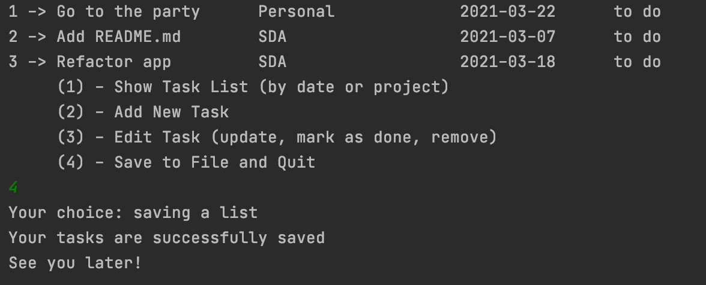

After restarting:

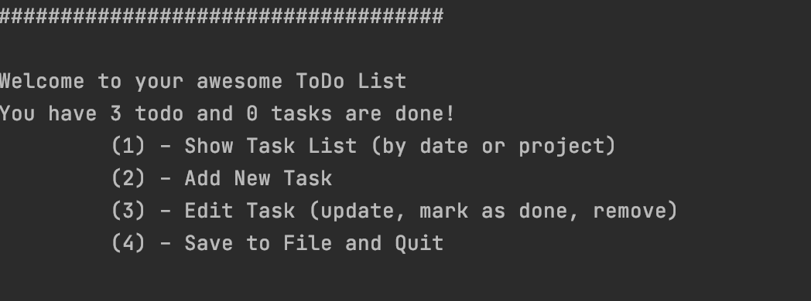
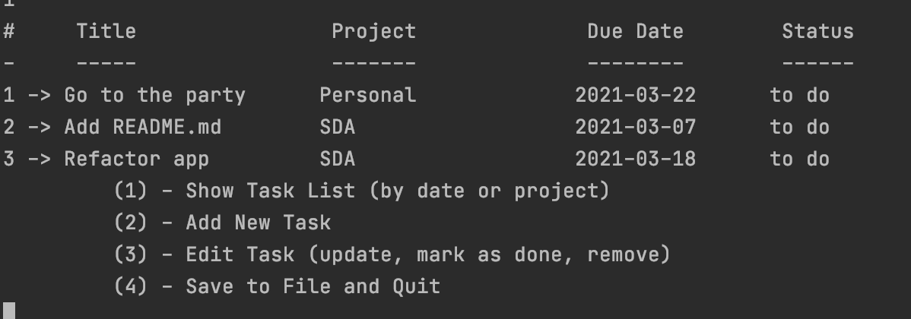